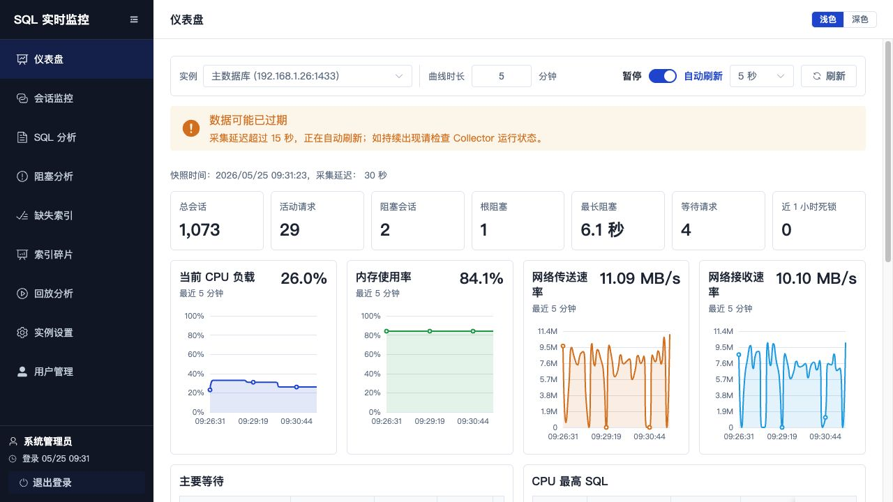
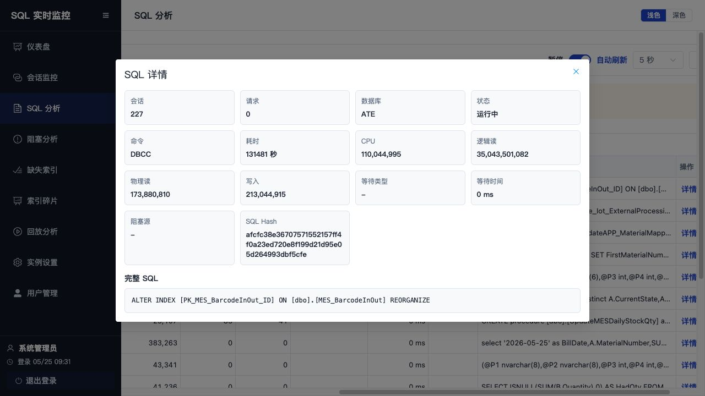
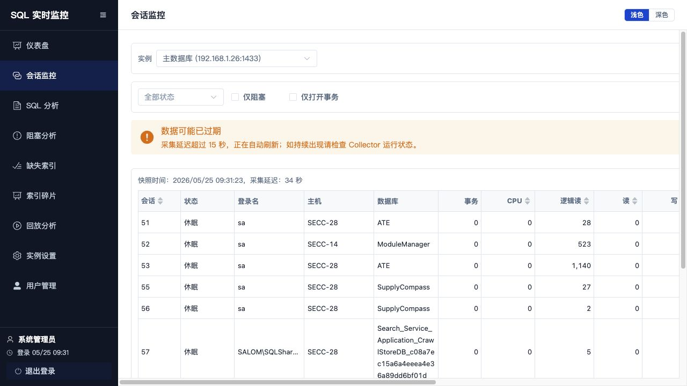
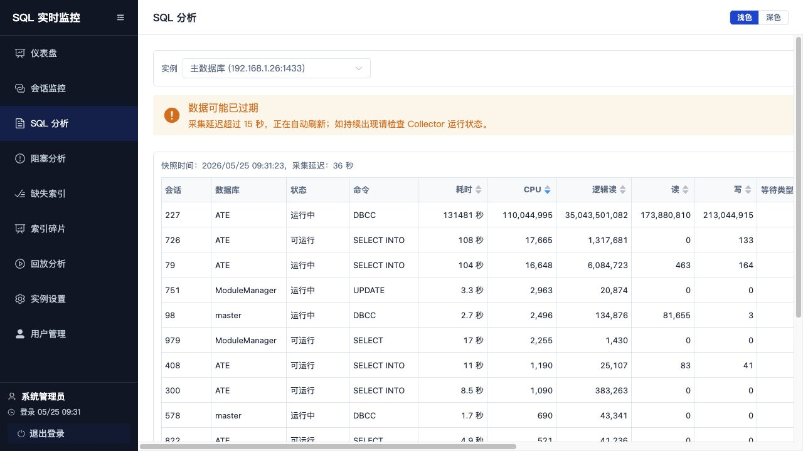
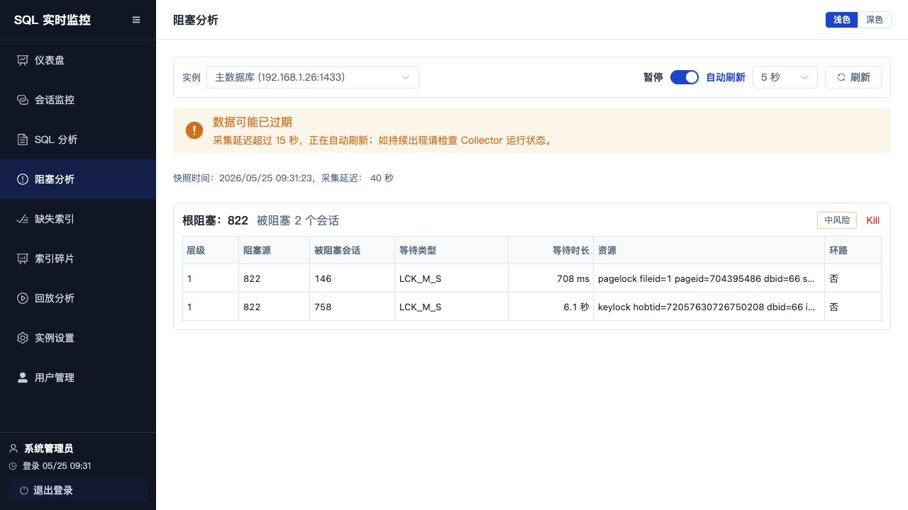
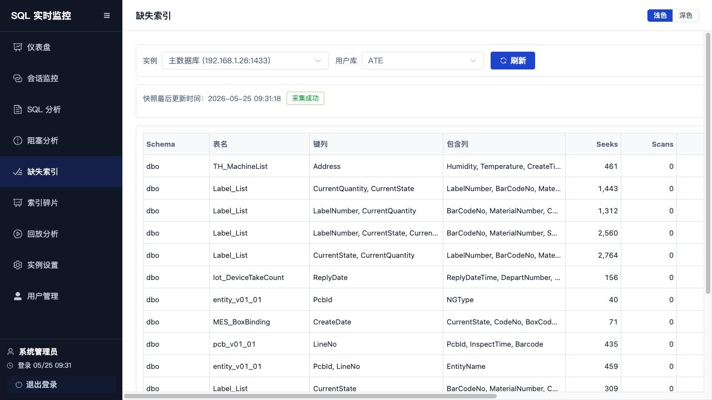
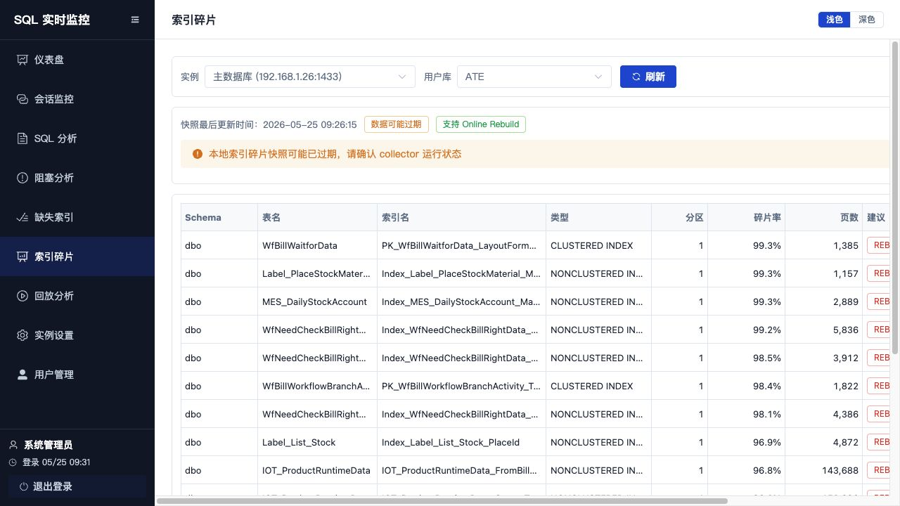
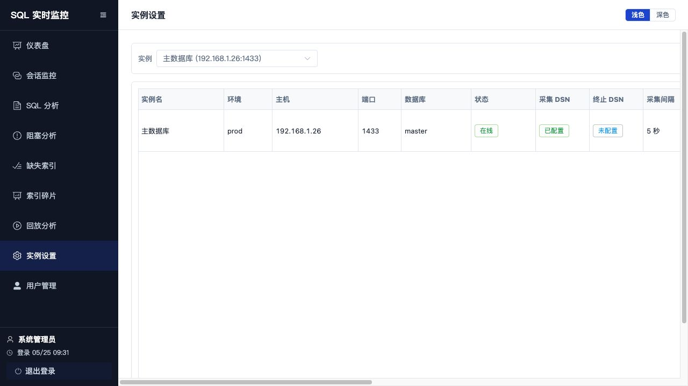
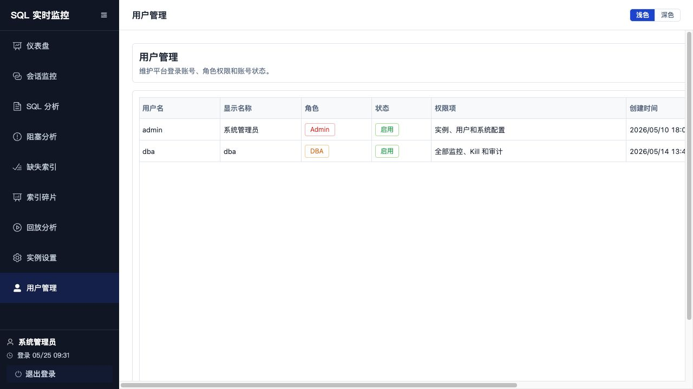

# SQL Server 实时监控平台说明文档

## 1. 文档说明

本文档基于当前项目 `/Users/chenxuan/sql/.worktrees/sqlmon-p0` 的代码、接口、部署脚本和已启动页面整理，面向 DBA、后端研发、运维/SRE 说明平台的启动方式、页面功能和完整排查流程。

当前本地启动地址：

| 服务 | 地址 | 说明 |
|---|---|---|
| 前端 | `http://127.0.0.1:5173` | Vue 3 + Vite 页面 |
| 后端 API | `http://127.0.0.1:8000/api` | FastAPI 服务 |
| 健康检查 | `http://127.0.0.1:8000/api/health` | 返回 `{"status":"ok"}` |

默认管理员由迁移脚本初始化：

| 用户名 | 密码 | 角色 |
|---|---|---|
| `admin` | `Admin@2026` | `admin` |

> 生产环境部署后应立即修改默认管理员密码，并配置长度不少于 32 字符的 `SQLMON_SECRET_KEY`。

## 2. 系统定位

SQL Server 实时监控平台用于统一接入多个 SQL Server 实例，帮助用户在一个页面内完成实时观察、会话分析、SQL 分析、阻塞链定位、Kill 处置和历史回放。

P0 已覆盖的核心闭环：

1. 登录和验证码校验。
2. 多实例配置、切换和连接测试。
3. Dashboard 实时总览。
4. Session 实时列表、筛选、排序和详情。
5. SQL 实时列表、排序和完整 SQL 查看。
6. 阻塞链展示，识别根阻塞和影响范围。
7. 缺失索引建议查看和索引创建。
8. 索引碎片查看、REORGANIZE / REBUILD 维护。
9. 历史回放，按时间查看历史快照。
10. 用户、角色和账号状态管理。
11. Kill Session 操作和审计接口。

## 3. 技术架构

```text
Browser
  |
  | HTTP / Vite proxy or Nginx
  v
Vue Frontend
  |
  | /api
  v
FastAPI Backend
  |
  | SQLAlchemy async
  v
PostgreSQL

Collector Worker
  |
  | pyodbc
  v
SQL Server Instances

Collector Worker
  |
  | snapshots / events
  v
PostgreSQL
```

主要目录：

| 目录 | 说明 |
|---|---|
| `frontend/` | Vue 3 + Vite 前端工程 |
| `backend/app/api/routes/` | FastAPI 路由 |
| `backend/app/services/` | 业务服务层 |
| `backend/app/collector/` | SQL Server 采集器 |
| `backend/app/db/migrations/` | Alembic 数据库迁移 |
| `deploy/` | systemd、Nginx、启动脚本和环境变量示例 |
| `docs/` | PRD、技术设计、验收清单和本文档 |

## 4. 启动流程

### 4.1 本地开发启动

后端服务：

```bash
cd backend
uvicorn app.main:app --host 127.0.0.1 --port 8000
```

前端服务：

```bash
cd frontend
npm install
npm run dev
```

前端 Vite 配置会把 `/api` 代理到 `http://localhost:8000`，因此页面内接口请求默认走同源 `/api`。

### 4.2 数据库迁移

```bash
cd backend
alembic upgrade head
```

部署脚本中也提供了等价入口：

```bash
APP_HOME=/opt/sqlmon deploy/scripts/migrate.sh
```

### 4.3 Collector 启动

Collector 用于从 SQL Server 周期采集 Session、Request、Wait、Blocking、资源趋势等快照：

```bash
cd backend
python -m app.collector.main
```

部署脚本入口：

```bash
APP_HOME=/opt/sqlmon deploy/scripts/start-collector.sh
```

### 4.4 生产部署要点

生产部署建议使用：

| 组件 | 文件 |
|---|---|
| API systemd | `deploy/systemd/sqlmon-api.service` |
| Collector systemd | `deploy/systemd/sqlmon-collector.service` |
| Nginx | `deploy/nginx/sqlmon.conf` |
| 环境变量 | `deploy/env/app.env.example` |

关键环境变量：

| 变量 | 说明 |
|---|---|
| `SQLMON_ENV` | 环境，生产配置为 `prod` |
| `SQLMON_SECRET_KEY` | JWT 和验证码签名密钥 |
| `SQLMON_DATABASE_URL` | PostgreSQL 连接串 |
| `SQLMON_ENCRYPTION_KEY` | 实例连接凭据加密密钥 |
| `SQLMON_API_HOST` / `SQLMON_API_PORT` | API 监听地址和端口 |
| `SQLMON_MIN_KILLABLE_SESSION_ID` | 允许 Kill 的最小 Session ID |

## 5. 登录流程

访问 `http://127.0.0.1:5173/login` 后，页面会加载 6 位数字验证码。输入用户名、密码和验证码后，后端返回访问令牌，前端保存登录态并跳转到仪表盘。


操作步骤：

1. 打开登录页。
2. 输入用户名和密码。
3. 输入图片中的 6 位验证码。
4. 验证码看不清时点击验证码图片或“换一张”。
5. 点击“登录”进入系统。

接口关系：

| 步骤 | API |
|---|---|
| 获取验证码 | `GET /api/auth/captcha` |
| 登录 | `POST /api/auth/login` |

## 6. 主界面说明

登录后进入主界面，左侧为导航栏，右侧为当前页面内容。左侧导航包含：

| 菜单 | 路由 | 说明 |
|---|---|---|
| 仪表盘 | `/dashboard` | 实例整体状态、资源趋势、Top Wait、Top SQL |
| 会话监控 | `/sessions` | 当前 Session 列表、筛选、详情、终止 |
| SQL 分析 | `/sqls` | 当前运行 SQL 列表、排序、详情 |
| 阻塞分析 | `/blocking` | 阻塞链和根阻塞识别 |
| 缺失索引 | `/indexes/missing` | 查看缺失索引建议并发起索引创建 |
| 索引碎片 | `/indexes/fragmentation` | 查看索引碎片率并执行索引维护 |
| 回放分析 | `/replay` | 按时间查询历史快照 |
| 实例设置 | `/settings/instances` | SQL Server 实例维护 |
| 用户管理 | `/settings/users` | 平台用户、角色和账号状态维护 |

右上角可切换浅色/深色主题。左下角显示当前登录用户、登录时间和退出登录按钮。

## 7. 全局实例和刷新控制

多数监控页面顶部都有实例选择器和刷新控制。

操作步骤：

1. 在“实例”下拉框选择目标 SQL Server 实例。
2. 切换实例后，当前页面会重新拉取该实例数据。
3. 开启“自动刷新”后，页面按选定间隔刷新。
4. 需要临时观察现场时，可切换为“暂停”。
5. 点击“刷新”可立即拉取最新快照。

当前截图环境中的实例为“主数据库 `(192.168.1.26:1433)`”。

## 8. 仪表盘使用流程

仪表盘是实时排障入口，用于先判断实例是否异常。



页面区域：

| 区域 | 说明 |
|---|---|
| 快照信息 | 展示快照时间和采集延迟 |
| 指标卡片 | 总会话、活动请求、阻塞会话、根阻塞、最长阻塞、等待请求、近 1 小时死锁 |
| 资源趋势 | CPU、内存、网络速率曲线 |
| 主要等待 | 当前 Wait 类型、类别、任务数和等待时长 |
| CPU 最高 SQL | 按 CPU 时间排序的 SQL |
| IO 最高 SQL | 按逻辑读/写入等指标展示高 IO SQL |

操作步骤：

1. 选择目标实例。
2. 根据“快照时间”和“采集延迟”判断数据是否新鲜。
3. 查看指标卡片，优先关注“阻塞会话”“根阻塞”“最长阻塞”“等待请求”。
4. 查看 CPU、内存、网络曲线，判断资源是否持续偏高。
5. 查看“主要等待”，识别锁等待、IO 等待或其他等待类型。
6. 在“CPU 最高 SQL”或“IO 最高 SQL”中点击“详情”查看完整 SQL。

SQL 详情弹窗示例：



## 9. 会话监控流程

会话监控用于查看当前所有 Session 的状态、来源、资源消耗、等待和当前 SQL。



页面能力：

| 控件/列 | 说明 |
|---|---|
| 状态筛选 | 支持运行中、休眠、挂起 |
| 仅阻塞 | 只查看存在阻塞关系的会话 |
| 仅打开事务 | 只查看打开事务数大于 0 的会话 |
| 排序列 | 会话、CPU、逻辑读、读、写等字段可排序 |
| 详情 | 打开 Session 详情抽屉 |
| 终止 | 打开 Kill 确认弹窗 |

排查步骤：

1. 进入“会话监控”。
2. 选择目标实例。
3. 需要定位阻塞时勾选“仅阻塞”。
4. 需要定位长事务时勾选“仅打开事务”。
5. 按 CPU、逻辑读、写入等列排序，找出资源消耗最高的 Session。
6. 点击“详情”查看 Session 的来源、SQL、等待和阻塞信息。
7. 如确认需要处置，点击“终止”，输入原因后提交。

Kill Session 处理流程：

```text
用户点击终止
  -> 前端弹出二次确认
  -> 用户输入原因
  -> 后端校验登录用户和安全规则
  -> 后端连接 SQL Server 执行 KILL
  -> 后端写入 kill_audits 审计记录
  -> 前端刷新会话/阻塞数据
```

相关接口：

| 功能 | API |
|---|---|
| 会话列表 | `GET /api/sessions` |
| 会话详情 | `GET /api/sessions/{session_id}` |
| 终止会话 | `POST /api/kill` |
| Kill 审计 | `GET /api/audits/kills` |

## 10. SQL 分析流程

SQL 分析用于查看当前正在执行的 SQL，并按 CPU、耗时、逻辑读、读、写、等待时间等指标排序。



操作步骤：

1. 进入“SQL 分析”。
2. 默认按 CPU 倒序查看高 CPU SQL。
3. 点击表头切换排序字段，例如耗时、逻辑读、写入、等待时间。
4. 查看 SQL 预览，确认数据库、Session、命令和等待类型。
5. 点击“详情”查看完整 SQL 文本、SQL Hash 和资源指标。

相关接口：

| 功能 | API |
|---|---|
| SQL 列表 | `GET /api/sqls` |
| SQL 详情 | `GET /api/sqls/{sql_hash}` |

## 11. 阻塞分析流程

阻塞分析用于展示阻塞链、根阻塞、被阻塞会话数、等待类型和锁资源。



页面字段：

| 字段 | 说明 |
|---|---|
| 根阻塞 | 阻塞链最上游 Session |
| 被阻塞会话数 | 当前链路影响范围 |
| 风险等级 | `low`、`medium`、`high` 对应低/中/高风险 |
| 层级 | 阻塞链深度 |
| 阻塞源 | 造成当前节点等待的 Session |
| 被阻塞会话 | 正在等待的 Session |
| 等待类型 | SQL Server Wait Type |
| 等待时长 | 当前等待持续时间 |
| 资源 | 锁资源描述 |
| 环路 | 是否检测到阻塞环 |

阻塞排查步骤：

1. 进入“阻塞分析”。
2. 找到风险等级最高、被阻塞会话最多或最长等待时间最高的链路。
3. 记录根阻塞 Session ID。
4. 回到“会话监控”，搜索或定位该 Session，查看打开事务、主机、程序和 SQL。
5. 回到“SQL 分析”，查看相关 SQL 的完整文本和资源指标。
6. 判断是否为长事务、未提交事务、锁竞争或批量任务。
7. 如需处置，通过“会话监控”的“终止”入口执行 Kill，并填写原因。

相关接口：

| 功能 | API |
|---|---|
| 阻塞链 | `GET /api/blocking` |

## 12. 缺失索引治理流程

缺失索引用于查看 SQL Server DMV 给出的索引建议，并在确认后发起 `CREATE INDEX` 操作。



页面字段：

| 字段 | 说明 |
|---|---|
| 用户库 | 当前实例下的非系统数据库 |
| 快照最后更新时间 | Collector 最近一次采集缺失索引数据的时间 |
| 采集状态 | `采集成功`、`数据可能过期`、`采集失败` 或 `等待采集` |
| 键列 | 建议索引的 equality + inequality 列 |
| 包含列 | 建议索引的 include columns |
| Seeks / Scans | DMV 统计的查找和扫描次数 |
| 平均成本 / 影响% | SQL Server 估算的成本和收益 |
| 建议索引名 | 平台生成的轻量索引名称 |
| 新建索引 | 打开创建确认弹窗 |

操作步骤：

1. 进入“缺失索引”。
2. 选择目标实例。
3. 在“用户库”下拉框选择需要治理的业务库。
4. 查看快照更新时间和采集状态，确认数据是否可用。
5. 按 Seeks、平均成本、影响% 等指标判断优先级。
6. 重点检查“键列”和“包含列”，确认是否符合业务查询模式。
7. 点击“新建索引”。
8. 在弹窗中确认目标表、键列、包含列和索引名。
9. 点击“确认创建”后，平台提交索引创建请求。
10. 如果后端返回后台执行状态，页面会轮询索引审计结果；完成后刷新列表确认。

相关接口：

| 功能 | API |
|---|---|
| 用户库列表 | `GET /api/indexes/databases` |
| 缺失索引列表 | `GET /api/indexes/missing` |
| 新建索引 | `POST /api/indexes` |
| 索引操作审计 | `GET /api/indexes/audits/{audit_id}` |

## 13. 索引碎片维护流程

索引碎片用于查看用户库中索引的碎片率、页数和平台建议动作，并在确认后执行 `REORGANIZE` 或 `REBUILD`。



页面字段：

| 字段 | 说明 |
|---|---|
| 用户库 | 当前实例下的非系统数据库 |
| Online Rebuild | 当前实例是否支持在线重建 |
| 索引名 | 目标索引名称 |
| 类型 | SQL Server 索引类型 |
| 分区 | 分区号 |
| 碎片率 | `avg_fragmentation_in_percent` |
| 页数 | `page_count` |
| 建议 | `NONE`、`REORGANIZE` 或 `REBUILD` |
| 操作 | 对可处理索引执行建议动作 |

维护步骤：

1. 进入“索引碎片”。
2. 选择目标实例和用户库。
3. 查看快照更新时间、采集状态和 Online Rebuild 支持情况。
4. 按碎片率和页数判断维护优先级。
5. 对建议为 `REORGANIZE` 或 `REBUILD` 的行点击“执行”。
6. 在弹窗中确认目标库、表、索引、分区、碎片率和动作。
7. 点击“确认执行”提交维护请求。
8. 如果操作进入后台执行，等待轮询结果或稍后刷新确认。

相关接口：

| 功能 | API |
|---|---|
| 索引碎片列表 | `GET /api/indexes/fragmentation` |
| 执行索引维护 | `POST /api/indexes/fragmentation/actions` |
| 索引操作审计 | `GET /api/indexes/audits/{audit_id}` |

注意事项：

1. 索引创建、重建和重组都会在 SQL Server 中执行 DDL，请在业务低峰或明确授权后操作。
2. `REBUILD` 在支持 Online Rebuild 的环境中会优先使用 `ONLINE = ON`。
3. 操作连接依赖实例配置中的可执行数据库连接；未配置时会返回无法执行。
4. 前端等待超时时，后台可能仍在执行，应通过审计结果或刷新页面确认最终状态。

## 14. 历史回放流程

回放分析用于按时间查询历史快照，复盘某一时刻的会话、SQL 和阻塞现场。


操作步骤：

1. 进入“回放分析”。
2. 选择目标实例。
3. 在时间选择器中选择需要复盘的时间点。
4. 点击“查询回放”。
5. 页面展示请求时间和命中快照时间。
6. 查看顶部指标卡片了解当时整体状态。
7. 在“会话”“SQL”“阻塞”标签页中分别查看现场数据。

回放匹配规则：

```text
用户选择时间
  -> 前端请求 /api/replay
  -> 后端查找不晚于目标时间的最近快照
  -> 返回 dashboard / sessions / sqls / blocking / waits / tempdb
  -> 前端按历史快照渲染
```

相关接口：

| 功能 | API |
|---|---|
| 历史回放 | `GET /api/replay` |

## 15. 实例设置流程

实例设置用于维护 SQL Server 接入配置、采集策略和责任人。



页面字段：

| 字段 | 说明 |
|---|---|
| 实例名 | 业务可读名称 |
| 环境 | `prod`、`staging`、`dev` 等 |
| 主机/端口 | SQL Server 地址 |
| 数据库 | 默认数据库 |
| 状态 | `online`、`offline`、`collect_error`、`disabled` |
| 采集 DSN | 是否已配置采集连接凭据 |
| 终止 DSN | 是否已配置 Kill 连接凭据 |
| 采集间隔 | Collector 采集周期 |
| 保留天数 | 历史快照保留周期 |
| 业务负责人 / DBA | 实例责任人 |
| SQL Server 版本 | 连接测试或采集得到的版本信息 |

新增实例步骤：

1. 点击“新增实例”。
2. 填写实例名称、IP 地址、端口。
3. 填写 SQL 认证用户名和密码。
4. 选择或输入数据库。
5. 设置采集间隔和保留天数。
6. 填写业务负责人和 DBA。
7. 点击“测试连接”，确认连接成功并获取数据库列表/版本信息。
8. 点击“保存”。

编辑实例步骤：

1. 在实例列表中点击“编辑”。
2. 修改基础信息、采集策略或责任人。
3. 如需重建 DSN，填写用户名和密码；留空则保留原密码。
4. 点击“测试连接”确认。
5. 点击“保存修改”。

连接测试说明：

| 场景 | 操作 |
|---|---|
| 测试新实例 | 弹窗中点击“测试连接” |
| 测试已有实例 | 列表行点击“测试” |
| 批量测试 | 顶部点击“测试状态” |
| 自动测试 | 打开“自动测试”，选择 5 秒到 300 秒间隔 |

相关接口：

| 功能 | API |
|---|---|
| 实例列表 | `GET /api/instances` |
| 新增实例 | `POST /api/instances` |
| 编辑实例 | `PUT /api/instances/{instance_id}` |
| 删除实例 | `DELETE /api/instances/{instance_id}` |
| 测试新连接 | `POST /api/instances/test-connection` |
| 测试已有连接 | `POST /api/instances/{instance_id}/test-connection` |

## 16. 用户管理流程

用户管理用于维护平台本地账号、角色权限和账号状态。



角色说明：

| 角色 | 权限说明 |
|---|---|
| Viewer | 基础指标只读 |
| Developer | Session、SQL、历史回放和完整 SQL |
| DBA | 全部监控、Kill、审计和索引治理 |
| Admin | 实例、用户和系统配置 |

新增用户步骤：

1. 进入“用户管理”。
2. 点击“新增用户”。
3. 填写用户名、显示名称和初始密码。
4. 选择角色。
5. 点击“保存”。

编辑用户步骤：

1. 在用户列表点击“编辑”。
2. 修改显示名称、角色或状态。
3. 点击“保存修改”。

重置密码步骤：

1. 在用户列表点击“重置密码”。
2. 输入不少于 8 位的新密码。
3. 点击“保存密码”。

禁用用户步骤：

1. 在用户列表点击“禁用”。
2. 在确认弹窗中再次确认。
3. 禁用后该用户无法继续登录平台。

限制说明：

1. 只有 `admin` 角色可以访问用户管理。
2. 当前登录用户不能禁用自己。
3. 用户名重复时，后端返回冲突错误。

相关接口：

| 功能 | API |
|---|---|
| 用户列表 | `GET /api/users` |
| 新增用户 | `POST /api/users` |
| 编辑用户 | `PUT /api/users/{user_id}` |
| 禁用用户 | `POST /api/users/{user_id}/disable` |
| 重置密码 | `POST /api/users/{user_id}/reset-password` |

## 17. 典型排障流程

### 17.1 实时阻塞排查

1. 打开“仪表盘”。
2. 查看“阻塞会话”“根阻塞”“最长阻塞”指标。
3. 如果存在明显阻塞，进入“阻塞分析”。
4. 找到风险最高或影响范围最大的阻塞链。
5. 记录根阻塞 Session ID。
6. 进入“会话监控”，打开该 Session 详情。
7. 查看主机、程序、登录名、打开事务数、等待类型和 SQL 预览。
8. 进入“SQL 分析”，查看相关 SQL 完整文本。
9. 确认是否需要 Kill。
10. 点击“终止”，填写原因并提交。
11. 回到“阻塞分析”或“仪表盘”，刷新确认阻塞是否解除。

### 17.2 高 CPU SQL 排查

1. 打开“仪表盘”。
2. 观察 CPU 曲线是否持续偏高。
3. 查看“CPU 最高 SQL”区域。
4. 点击“详情”查看 SQL 文本和执行信息。
5. 进入“SQL 分析”，按 CPU 倒序进一步查看更多 SQL。
6. 结合数据库、命令、执行时长、逻辑读和等待类型判断问题性质。

### 17.3 高 IO SQL 排查

1. 打开“仪表盘”。
2. 观察网络速率和 IO 最高 SQL。
3. 进入“SQL 分析”。
4. 按逻辑读、读、写排序。
5. 打开 SQL 详情，确认是否为大表扫描、批量写入或报表任务。

### 17.4 历史现场复盘

1. 明确问题发生时间。
2. 进入“回放分析”。
3. 选择实例和问题时间点。
4. 查询回放并记录命中快照时间。
5. 查看当时的指标、会话、SQL 和阻塞。
6. 必要时结合 Kill 审计接口查看处置记录。

### 17.5 缺失索引治理

1. 进入“缺失索引”。
2. 选择实例和用户库。
3. 查看采集状态，确认快照不是过期或失败。
4. 优先关注 Seeks 高、平均成本高、影响% 高的建议。
5. 对照业务 SQL 和已有索引确认是否需要新建。
6. 点击“新建索引”并确认索引名、键列和包含列。
7. 提交后等待审计结果。
8. 返回“SQL 分析”或业务侧观察查询性能变化。

### 17.6 索引碎片维护

1. 进入“索引碎片”。
2. 选择实例和用户库。
3. 按碎片率、页数和建议动作筛选维护目标。
4. 对建议为 `REORGANIZE` 或 `REBUILD` 的索引执行维护。
5. 对大表或高峰期敏感表，先确认维护窗口和锁风险。
6. 操作后刷新页面确认碎片率和审计结果。

## 18. 验收和检查

后端测试：

```bash
cd backend
python3 -m pytest -v
```

前端构建：

```bash
cd frontend
npm run build
```

基础接口检查：

```bash
curl http://127.0.0.1:8000/api/health
```

P0 验收清单见：

```text
docs/p0-acceptance-checklist.md
```

## 19. 常见问题

### 19.1 登录失败

检查项：

1. 用户名和密码是否正确。
2. 验证码是否为当前图片中的 6 位数字。
3. 验证码是否已过期。
4. 后端 API 是否正常启动。

### 19.2 页面显示无数据或数据过旧

检查项：

1. 当前实例是否选择正确。
2. Collector 是否运行。
3. 实例状态是否为 `online`。
4. PostgreSQL 中是否存在最新快照。
5. 页面顶部快照时间和采集延迟是否异常。

### 19.3 实例连接测试失败

检查项：

1. SQL Server 主机和端口是否可达。
2. SQL 认证用户名和密码是否正确。
3. 默认数据库是否存在。
4. 服务器是否安装 Microsoft ODBC Driver 18。
5. SQL Server 账号是否具备采集所需 DMV 权限。

### 19.4 Kill Session 失败

检查项：

1. 当前用户是否具备处置权限。
2. Session ID 是否低于 `SQLMON_MIN_KILLABLE_SESSION_ID`。
3. 实例是否配置终止 DSN。
4. Kill 连接账号是否具备执行 `KILL` 的权限。
5. 目标 Session 是否已经结束。

### 19.5 索引页面无数据

检查项：

1. 当前实例是否已有可用用户库。
2. Collector 是否已完成索引采集。
3. `SQLMON_INDEX_COLLECT_DATABASE_CONCURRENCY` 和采集超时是否适合当前库数量和表规模。
4. 采集账号是否具备查询缺失索引 DMV、`sys.indexes` 和 `sys.dm_db_index_physical_stats` 的权限。
5. 页面快照状态是否提示采集失败或数据过期。
